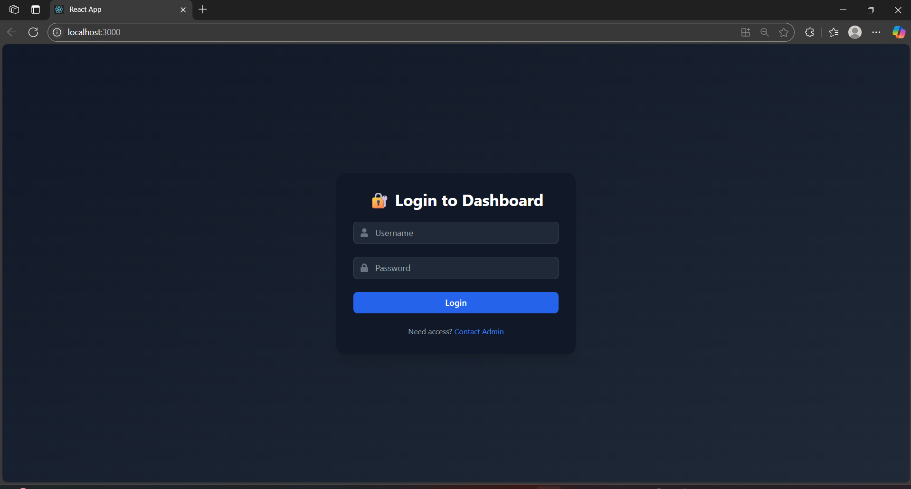
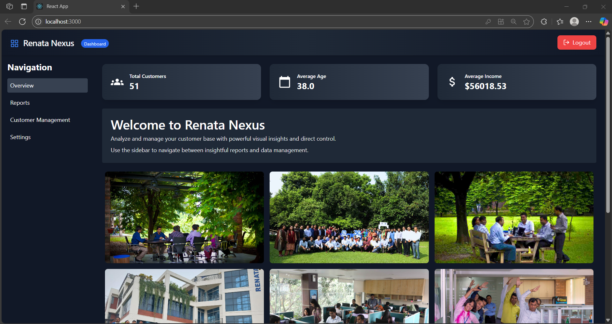
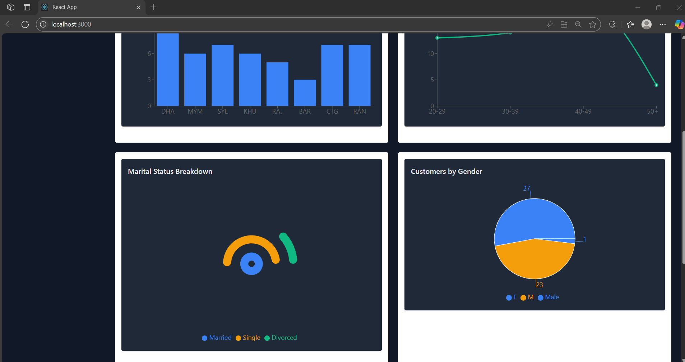
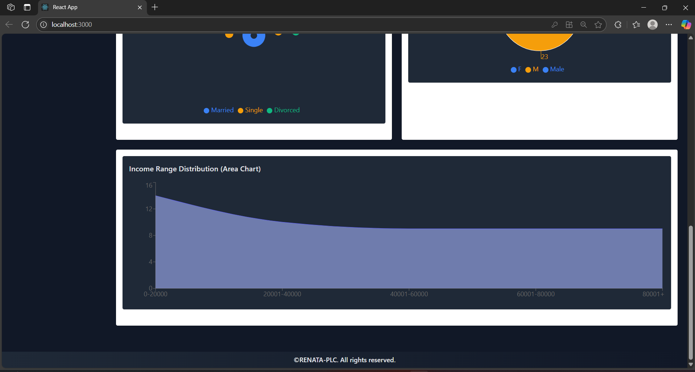
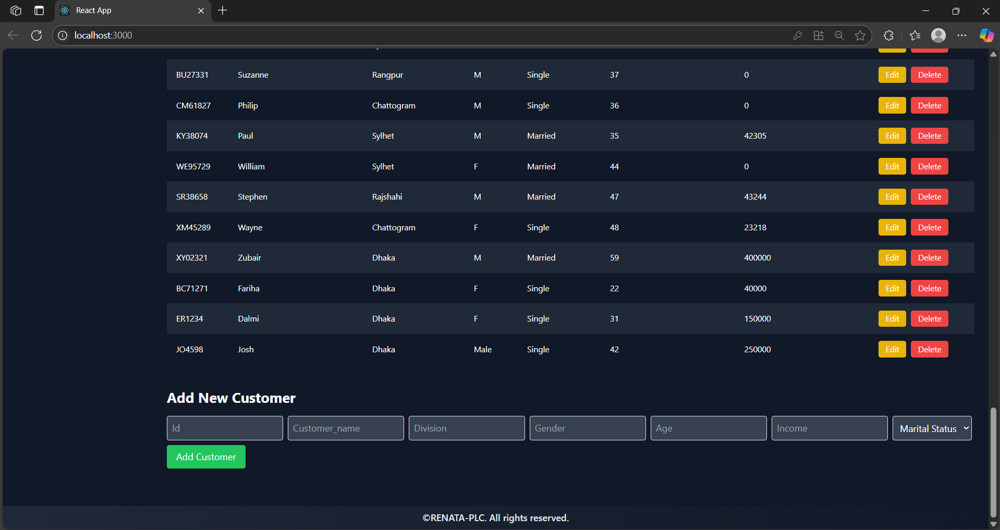
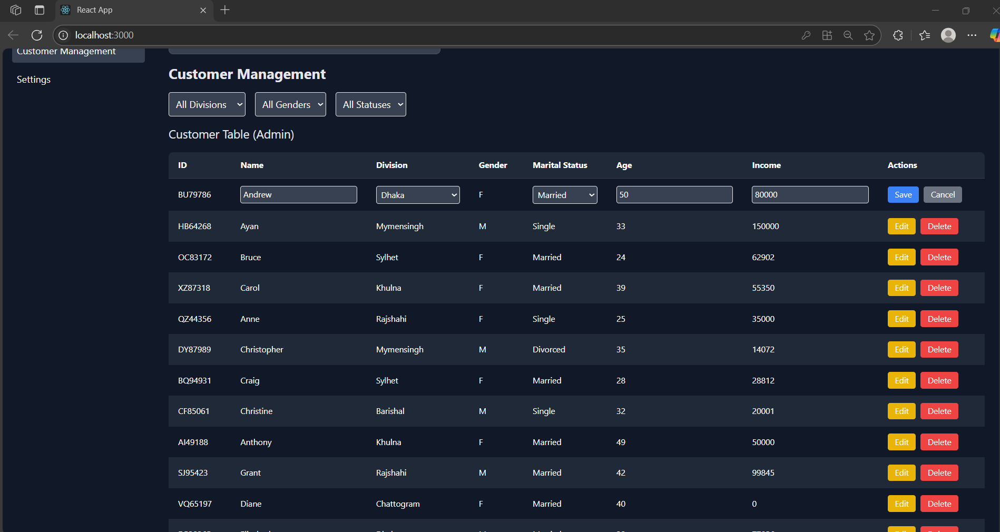
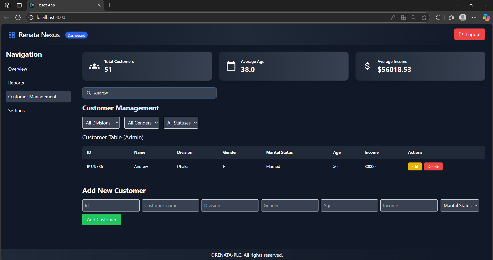
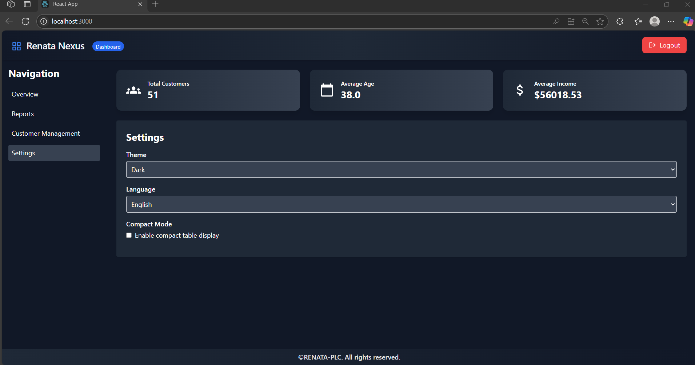
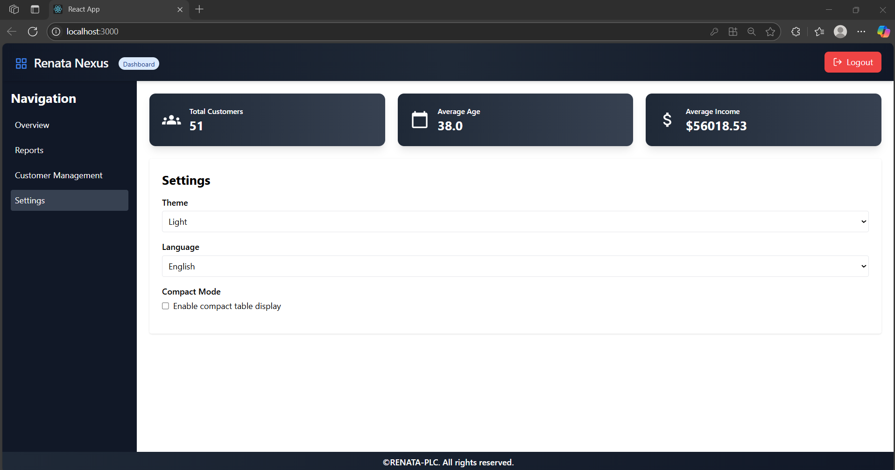
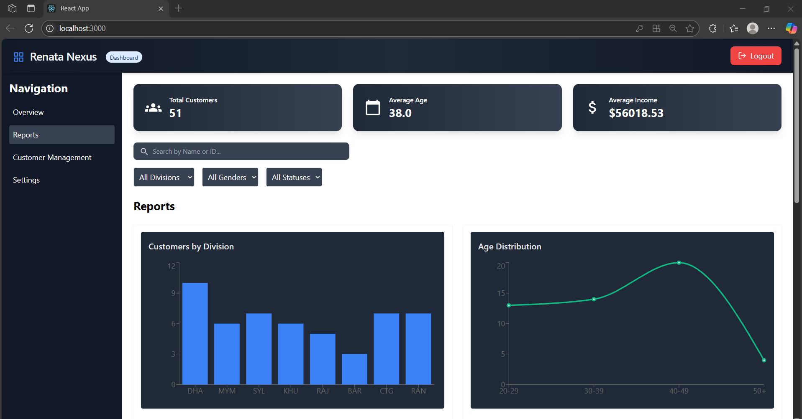

# Renata Nexus Dashboard

A full-stack customer management and analytics system for Renata PLC. This dashboard allows authorized users to manage customer records, visualize demographics, and monitor business metrics using real-time charts and interactive controls.

---

## 🌐 Live Environment

> This project runs locally.

---

## 📁 Project Structure

```
Renata-Nexus/
├── dashboard-frontend/  # React frontend
├── dashboard-backend/   # Express + SQLite backend
├── customers.csv        # Seed data used to populate the database
├── README.md            # Instructions & project documentation
```

---

## ⚙️ Tech Stack

* **Frontend**: React.js, Tailwind CSS, Recharts
* **Backend**: Node.js, Express.js
* **Database**: SQLite
* **File-based Input**: CSV parsing with `csv-parser`

---

## 🚀 Features

* 🔐 Role-based Login (Admin, SalesRep)
* 📊 Dashboard Analytics (charts by division, gender, age, income, etc.)
* 👥 Add / Edit / Delete customers
* 🔎 Filter & Search by Division, Gender, Status, Name
* 🌙 Dark mode & light mode support
* 📁 CSV + SQLite data sync on add
* 🧾 Clean UI with React Icons and responsive layout

---

## 🧪 How to Run the Project Locally

### 1. Clone the Repository

```bash
git clone https://github.com/immza/Renata-Nexus.git
cd Renata-Nexus
```

### 2. Set Up Backend

```bash
cd dashboard-backend
npm install
```

#### ➕ Seed the database

```bash
node customerInsert.js
```

#### ▶️ Start the backend

```bash
node server.js
```

Server runs at: `http://localhost:5000`

### 3. Set Up Frontend

Open a new terminal tab:

```bash
cd ../dashboard-frontend
npm install
npm start
```

Frontend runs at: `http://localhost:3000`

---

## 🔐 Default Login Credentials

| Role     | Username | Password |
| -------- | -------- | -------- |
| Admin    | admin    | admin123 |
| SalesRep | sales    | sales123 |

---

## 📸 Screenshots

* Dashboard KPI Cards
* Interactive Filters
* Charts (Bar, Pie, Line, Area, Radial)
* Add/Edit/Delete Interface

Images - 

 
### 🔷 Login Overview


---

### 🔷 Dashboard Overview

---

### 🔷 Report 

---


---


---

### 🔷 Table 


---

### 🔷 Add New Customer


---

### 🔷 Edit/Delete

---

### 🔷 Filter

---

### 🔷 Search Keywords

---

### 🔷Toggle Dark/Light

---


---


---


## 👨‍💻 Author

**Built by Moinuddin Zubair Ayan as part of a job assignment for Renata PLC.

---
> Thank you for reviewing the assignment! 🙌

